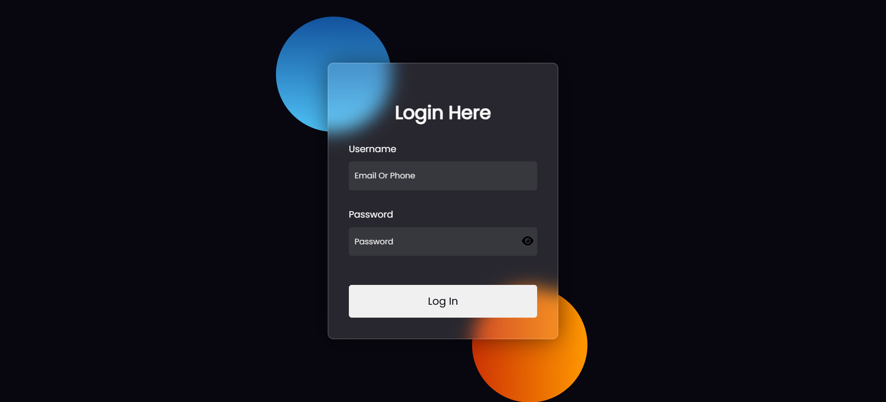

# ✨ Modern Login Page UI

A visually stunning, glassmorphic login page built using **HTML**, **CSS**, and **JavaScript**.  
Perfect for front-end practice and integration in stylish websites.

## 📑 Table of Contents
- [Features](#-features)
- [Live Url](#-live-url)
- [How It Works](#-how-it-works)
- [Author](#-author)

---

## 🚀 Live Url

👉[Live Site Url](https://mobyiin.github.io/Login-Page-Component)

---

## 🌈 Features

- 🧊 Glassmorphism design
- 💡 Glowing orbs for modern UI effect
- 🔐 Password visibility toggle with eye icon
- 📱 Responsive layout for all screens
- ✨ Clean, structured code

---

## 🛠️ Built With

- HTML5
- CSS3 (Flexbox, blur effects, gradients)
- JavaScript (DOM interaction)

---

## 💡 How It Works

- 👁️ Clicking the "eye" icon toggles the password input type between `password` and `text`.
- 🎨 Background glow effects are created using gradient-filled circles.
- 🧊 Glass card is styled with `backdrop-filter: blur()` and semi-transparent white.

---
## 🧑‍💻 Author
<ul dir="auto">
  <li>
    GitHub -
    <a href=https://github.com/Mobyiin>@Mobyiin</a>
  </li>
  <li>
    Telegram -
    <a href=https://t.me/MobyiinDev>@MobyiinDev</a>
  </li>
</ul>
